# Image processing
Blending and pasting images
Blending helps to combine two images together to create  new one, similar to mixing color or palette. This is often used in making images look more visually appealing or for smooth transitions in videos. Pasting is placing one picture on top of another at specific location/sport; like putting sticker on top of pictural background. In computer vision, pasting is used when you want to add something to an image, like highlighting a detected object by putting a box around it. Now, let's consider a situation where you are working on a security camera system. When the system detects an object, you might want to highlight it in the video. Here, you could use pasting to add a visible indicator or a bounding box around the detected object. Moreover, when you need to smoothly transition between frames in the video, blending can be used to create a more visually appealing and less abrupt change. 
Blending images is done through addWeighted function using following simple formula:
new_pixel = alpha * pixel¬_1 + pixel_2 + gama (doing added sum)	
if the images are not of same size, need to do masking.

```Python
import cv2
import matplotlib.pyplot as plt
```
```Python
img1 = cv2.imread('card-2.jpg')
img1 = cv2.cvtColor(img1, cv2.COLOR_BGR2RGB)
plt.imshow(img1)
img1.shape
```
```Python
img2 = cv2.imread('card-2.png')
img2 = cv2.cvtColor(img2, cv2.COLOR_BGR2RGB)
plt.imshow(img2)
img2.shape
```

### Blending Images of Same Size
Resizeing both the image to same image level
```Python
img1 = cv2.resize(img1, (1200, 1200))
img2 =cv2.resize(img2, (1200, 1200))
plt.imshow(img1)
plt.imshow(img2)
```
#### Bleaning images together
addWeighted(scr1, alpha, scr2, beta, gama)                                 
alpha and beta determines contribution of intensity by img1 and img2, scalled between 0 and 1. gama value is average value of two image, if 0 no impact, if negative its darker and if positive its brighter.
```Python
blend_img = cv2.addWeighted(src1=img1, alpha=0.5, src2=img2, beta=0.0, gamma=0)
plt.imshow(blend_img)
```
OUTPUT Img         
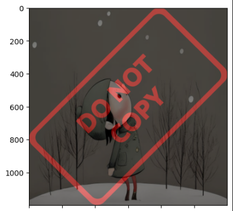

## Overlaying small image on top of larger image (No Blending) Numpy reassignment
## Blend images of different sizes                  
Taking chunk of small image and place at specific point on the other image without blending
```Python
img1 = cv2.imread('card-2.jpg')
img1 = cv2.cvtColor(img1, cv2.COLOR_BGR2RGB)
img2 = cv2.imread('card-2.png')
img2 = cv2.cvtColor(img2, cv2.COLOR_BGR2RGB)
img1 = cv2.resize(img1, (600, 600))
plt.imshow(img1)
x_offset = 0 # x y cordinate of image for numpy array slicing
y_offset = 0

x_end = x_offset + img1.shape[1]
y_end = y_offset + img1.shape[0]
img1.shape
img2[y_offset: y_end, x_offset:x_end] = img1
plt.imshow(img2)
```
OUTPUT Img.
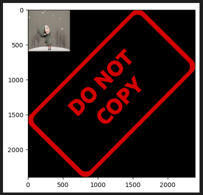

## Blending Images with different size
If required we can explor on the topic

# Image Thresholding
For certain computer vision color image is converted to grayscale since only edges and shapes end are region of interest. Some application only needs black or white. Thresholidng is fundamentally is simple method of segmenting an image into different parts, only two values white or black. 

Image segmentation is extracting image from background that can be easier to process.
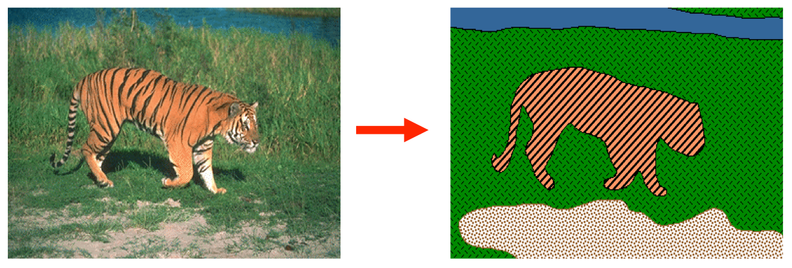
In the image tiger is separated, grass is separate, brown ground is seperated and water is separated aswell. 
So thresholdig is easier form of image segmentation with intensity value of pixel, applied only in grayscale image. 
Type of thresholding:
Global Thresholding where one value will be applied to all other general pixel 
Algorithum are following.
manual, otsu, triangle
Adaptive Thresholding break one image into small  values, calculate thresholing value for each. 
Mean, Gaussian, Niblack, Sauvola

Image tyoe otsu's method is applied to images where there is bi-modal where there is pick comes, histogram
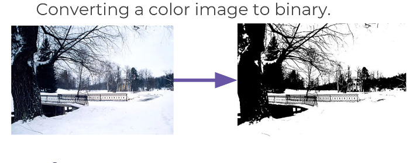

```Python
img = cv2.imread('card-2.png')
plt.imshow(img)
```
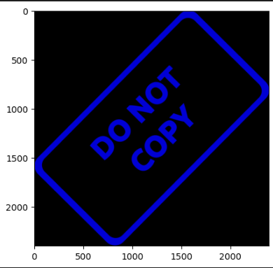

```Python
img = cv2.imread('card-2.png', 0)
plt.imshow(img)
```
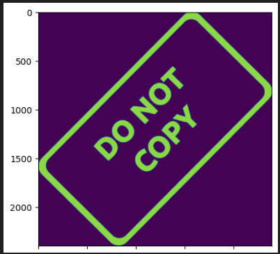

```Python
img = cv2.imread('card-2.png', 0)
plt.imshow(img, cmap = 'gray')
```
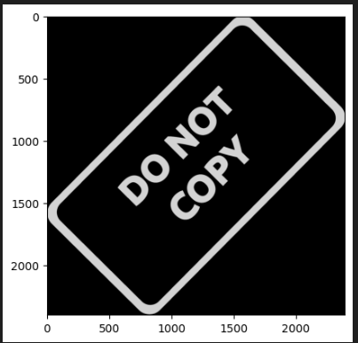

Any value below 127, half of 255 is shifted to 0 and any value more than 127 shifted to 1. 

```Python
ret,thresh1 = cv2.threshold(img, 127, 255, cv2.THRESH_BINARY)
ret
plt.imshow(thresh1, cmap = 'gray')
```
OUTPUT Img.
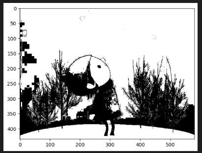

If we want to invert the color of the image, we get at white place black color and vice verasa. 
```Python
ret,thresh1 = cv2.threshold(img, 127, 255, cv2.THRESH_BINARY_INV)
ret
plt.imshow(thresh1, cmap = 'gray')
```
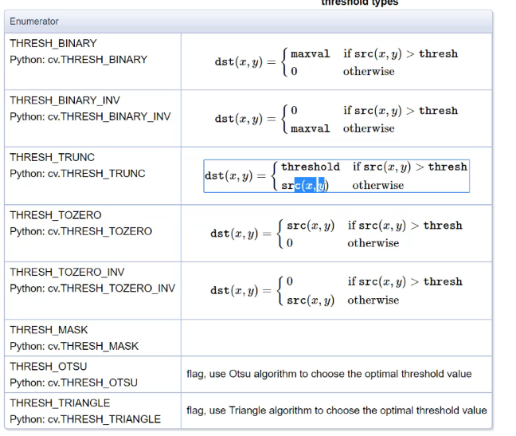

This method with condition either will drop the value to 0 or keep the value as it is as the of original value. Supposer if value is less than threshold it will drop to zero and if its above it will keep value as it is from 127 to 255.
```Python
ret,thresh1 = cv2.threshold(img, 127, 255, cv2.THRESH_TRUNC)
ret
plt.imshow(thresh1, cmap = 'gray')
```
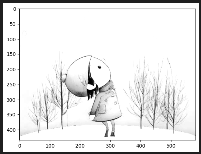

```Python
image = cv2.imread('card-2.jpg', 0)
plt.imshow(image, cmap = 'gray')
```

Read image, with normal commaded we find the image is bluery, so we use function to maintain certain ratio, then using threshold binary we get some clear words inside. 
```Python
image = cv2.imread('card-2.jpg', 0)
plt.imshow(image, cmap = 'gray')
def show_pic(img):
    fig = plt.figure(figsize = (15,15))
    ax = fig.add_subplot(111)
    ax.imshow(img, cmap = 'gray')
show_pic(image)
ret, threshold1 = cv2.threshold(image, 127, 255, cv2.THRESH_BINARY)
show_pic(threshold1)
```
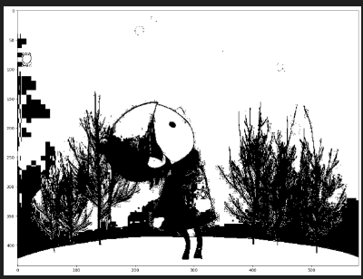
 If we change the value of 127 to higer or lower we are changing the threshold resulting for darker or light dark image. 

Addative threshold will adapt to need of the pixel, no need to manually type in value 
```Python
thr2 = cv2.adaptiveThreshold(image, 255, cv2.ADAPTIVE_THRESH_MEAN_C, cv2.THRESH_BINARY, 11,8)
show_pic(thr2)
```
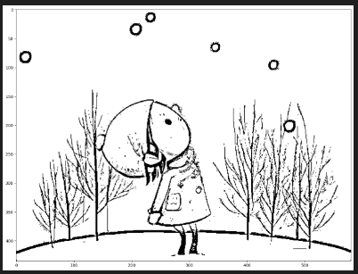

Blending both image together we get better image
```Python
blended = cv2.addWeighted(src1 = threshold1, alpha = 0.5, src2 = thr2, beta = 0.5, gamma = 0)
show_pic(blended)
```
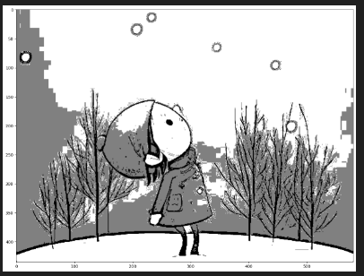

## Blurring and smoothing image
Blurring and smothing images helpstoget ridof noise, or helpapplication focuse on general details; bluring and smoothing is combined with edge detection, where edge detection algorithms detect too many edges when shown a high resolution image without any blurring.            
In the given image we try to detect edges of the dog face, without bluring there we found too many details/noise like the image in the middle.  Just to detect the general edges of the image we can just blur the image and apply edge detection algorithm.                                
One method we can use is gamma correction, applied to an image to make it appear brighter or darker depending on the gamma value choosen.                               
Kernel based filter
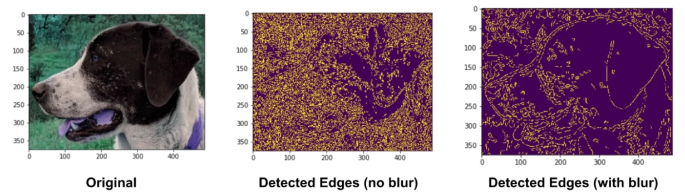
```Python
import cv2
import numpy as np
import matplotlib.pyplot as plt

def load_img():
    img = cv2.imread('card-2.jpg').astype(np.float32)/255
    img = cv2.cvtColor(img, cv2.COLOR_BGR2RGB)
    return img

load_img()

def display_img(img):
    fig = plt.figure(figsize=(12, 10))
    ax = fig.add_subplot(111)
    ax.imshow(img)

i = load_img()
display_img(i)
```
With choosing the value more and more smaller, image will be brighter and increasing value more than 1 will create image more darker. 
```Python
gamma = 1/10

result = np.power(i, gamma)
display_img(result)
```
Bluring we do is low pass filter in 2D convolution.
```Python
img = load_img()
font = cv2.FONT_HERSHEY_COMPLEX
cv2.putText(img, text = 'CARD-2', org = (10, 300), fontFace = font, fontScale = 3, color = (255, 0, 0), thickness = 4)

display_img(img)
```
Output:                         
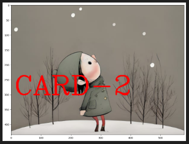

```Python
kernel = np.ones(shape = (5, 5), dtype = np.float32) / 25
kernel
```
The image appears some what blurry compared to original image. 
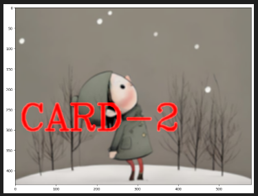

Applying default kernel, with kernel value the blurring effect becomes more intensed.

```Python
blurred = cv2.blur(img, ksize = (5, 5))
display_img(blurred)
```

```Python
gaussblurred = cv2.GaussianBlur(img, (5, 5), 10)
display_img(gaussblurred)
```
Good for removing noise from image, median blurring is good option.
```Python
medianblur = cv2.medianBlur(img, 5)
display_img(medianblur)
```
Making noise version of the given image\
```Python
img = cv2.imread('card-3.jPg')
img = cv2.cvtColor(img, cv2.COLOR_BGR2RGB)

display_img(img)
```
Removes unwanted  noise, keep edges very sharp but its slower compared to other filter.
```Python
blur = cv2.bilateralFilter(img, 9, 75, 75)
display_img(blur)
```