# Image processing
Blending and pasting images
Blending helps to combine two images together to create  new one, similar to mixing color or palette. This is often used in making images look more visually appealing or for smooth transitions in videos. Pasting is placing one picture on top of another at specific location/sport; like putting sticker on top of pictural background. In computer vision, pasting is used when you want to add something to an image, like highlighting a detected object by putting a box around it. Now, let's consider a situation where you are working on a security camera system. When the system detects an object, you might want to highlight it in the video. Here, you could use pasting to add a visible indicator or a bounding box around the detected object. Moreover, when you need to smoothly transition between frames in the video, blending can be used to create a more visually appealing and less abrupt change. 
Blending images is done through addWeighted function using following simple formula:
new_pixel = alpha * pixel¬_1 + pixel_2 + gama (doing added sum)	
if the images are not of same size, need to do masking.

```Python
import cv2
import matplotlib.pyplot as plt
```
```Python
img1 = cv2.imread('card-2.jpg')
img1 = cv2.cvtColor(img1, cv2.COLOR_BGR2RGB)
plt.imshow(img1)
img1.shape
```
```Python
img2 = cv2.imread('card-2.png')
img2 = cv2.cvtColor(img2, cv2.COLOR_BGR2RGB)
plt.imshow(img2)
img2.shape
```

### Blending Images of Same Size
Resizeing both the image to same image level
```Python
img1 = cv2.resize(img1, (1200, 1200))
img2 =cv2.resize(img2, (1200, 1200))
plt.imshow(img1)
plt.imshow(img2)
```
#### Bleaning images together
addWeighted(scr1, alpha, scr2, beta, gama)                                 
alpha and beta determines contribution of intensity by img1 and img2, scalled between 0 and 1. gama value is average value of two image, if 0 no impact, if negative its darker and if positive its brighter.
```Python
blend_img = cv2.addWeighted(src1=img1, alpha=0.5, src2=img2, beta=0.0, gamma=0)
plt.imshow(blend_img)
```
OUTPUT Img         


## Overlaying small image on top of larger image (No Blending) Numpy reassignment
## Blend images of different sizes                  
Taking chunk of small image and place at specific point on the other image without blending
```Python
img1 = cv2.imread('card-2.jpg')
img1 = cv2.cvtColor(img1, cv2.COLOR_BGR2RGB)
img2 = cv2.imread('card-2.png')
img2 = cv2.cvtColor(img2, cv2.COLOR_BGR2RGB)
img1 = cv2.resize(img1, (600, 600))
plt.imshow(img1)
x_offset = 0 # x y cordinate of image for numpy array slicing
y_offset = 0

x_end = x_offset + img1.shape[1]
y_end = y_offset + img1.shape[0]
img1.shape
img2[y_offset: y_end, x_offset:x_end] = img1
plt.imshow(img2)
```
OUTPUT Img.


## Blending Images with different size
If required we can explor on the topic

# Image Thresholding
For certain computer vision color image is converted to grayscale since only edges and shapes end are region of interest. Some application only needs black or white. Thresholidng is fundamentally is simple method of segmenting an image into different parts, only two values white or black. 

Image segmentation is extracting image from background that can be easier to process.

In the image tiger is separated, grass is separate, brown ground is seperated and water is separated aswell. 
So thresholdig is easier form of image segmentation with intensity value of pixel, applied only in grayscale image. 
Type of thresholding:
Global Thresholding where one value will be applied to all other general pixel 
Algorithum are following.
manual, otsu, triangle
Adaptive Thresholding break one image into small  values, calculate thresholing value for each. 
Mean, Gaussian, Niblack, Sauvola

Image tyoe otsu's method is applied to images where there is bi-modal where there is pick comes, histogram


```Python
img = cv2.imread('card-2.png')
plt.imshow(img)
```


```Python
img = cv2.imread('card-2.png', 0)
plt.imshow(img)
```


```Python
img = cv2.imread('card-2.png', 0)
plt.imshow(img, cmap = 'gray')
```


Any value below 127, half of 255 is shifted to 0 and any value more than 127 shifted to 1. 

```Python
ret,thresh1 = cv2.threshold(img, 127, 255, cv2.THRESH_BINARY)
ret
plt.imshow(thresh1, cmap = 'gray')
```
OUTPUT Img.


If we want to invert the color of the image, we get at white place black color and vice verasa. 
```Python
ret,thresh1 = cv2.threshold(img, 127, 255, cv2.THRESH_BINARY_INV)
ret
plt.imshow(thresh1, cmap = 'gray')
```


This method with condition either will drop the value to 0 or keep the value as it is as the of original value. Supposer if value is less than threshold it will drop to zero and if its above it will keep value as it is from 127 to 255.
```Python
ret,thresh1 = cv2.threshold(img, 127, 255, cv2.THRESH_TRUNC)
ret
plt.imshow(thresh1, cmap = 'gray')
```


```Python
image = cv2.imread('card-2.jpg', 0)
plt.imshow(image, cmap = 'gray')
```

Read image, with normal commaded we find the image is bluery, so we use function to maintain certain ratio, then using threshold binary we get some clear words inside. 
```Python
image = cv2.imread('card-2.jpg', 0)
plt.imshow(image, cmap = 'gray')
def show_pic(img):
    fig = plt.figure(figsize = (15,15))
    ax = fig.add_subplot(111)
    ax.imshow(img, cmap = 'gray')
show_pic(image)
ret, threshold1 = cv2.threshold(image, 127, 255, cv2.THRESH_BINARY)
show_pic(threshold1)
```

 If we change the value of 127 to higer or lower we are changing the threshold resulting for darker or light dark image. 

Addative threshold will adapt to need of the pixel, no need to manually type in value 
```Python
thr2 = cv2.adaptiveThreshold(image, 255, cv2.ADAPTIVE_THRESH_MEAN_C, cv2.THRESH_BINARY, 11,8)
show_pic(thr2)
```


Blending both image together we get better image
```Python
blended = cv2.addWeighted(src1 = threshold1, alpha = 0.5, src2 = thr2, beta = 0.5, gamma = 0)
show_pic(blended)
```


## Blurring and smoothing image
Blurring and smothing images helpstoget ridof noise, or helpapplication focuse on general details; bluring and smoothing is combined with edge detection, where edge detection algorithms detect too many edges when shown a high resolution image without any blurring.            
In the given image we try to detect edges of the dog face, without bluring there we found too many details/noise like the image in the middle.  Just to detect the general edges of the image we can just blur the image and apply edge detection algorithm.                            
The purpose of blurring is to reduce the amount of noise and detail in an image, which can help with tasks such as thresholding and edge detection. Blurring also smooths out the image and makes it more visually appealing.                         
One method we can use is gamma correction, applied to an image to make it appear brighter or darker depending on the gamma value choosen.                               
Kernel based filter

```Python
import cv2
import numpy as np
import matplotlib.pyplot as plt

def load_img():
    img = cv2.imread('card-2.jpg').astype(np.float32)/255
    img = cv2.cvtColor(img, cv2.COLOR_BGR2RGB)
    return img

load_img()

def display_img(img):
    fig = plt.figure(figsize=(12, 10))
    ax = fig.add_subplot(111)
    ax.imshow(img)

i = load_img()
display_img(i)
```
With choosing the value more and more smaller, image will be brighter and increasing value more than 1 will create image more darker. 
```Python
gamma = 1/10

result = np.power(i, gamma)
display_img(result)
```
Bluring we do is low pass filter in 2D convolution.
```Python
img = load_img()
font = cv2.FONT_HERSHEY_COMPLEX
cv2.putText(img, text = 'CARD-2', org = (10, 300), fontFace = font, fontScale = 3, color = (255, 0, 0), thickness = 4)

display_img(img)
```
Output:                         


```Python
kernel = np.ones(shape = (5, 5), dtype = np.float32) / 25
kernel
```
The image appears some what blurry compared to original image. 


Applying default kernel, with kernel value the blurring effect becomes more intensed.

```Python
blurred = cv2.blur(img, ksize = (5, 5))
display_img(blurred)
```

```Python
gaussblurred = cv2.GaussianBlur(img, (5, 5), 10)
display_img(gaussblurred)
```
Good for removing noise from image, median blurring is good option.
```Python
medianblur = cv2.medianBlur(img, 5)
display_img(medianblur)
```
Making noise version of the given image\
```Python
img = cv2.imread('card-3.jPg')
img = cv2.cvtColor(img, cv2.COLOR_BGR2RGB)

display_img(img)
```
Removes unwanted  noise, keep edges very sharp but its slower compared to other filter.
```Python
blur = cv2.bilateralFilter(img, 9, 75, 75)
display_img(blur)
```

## Morphological Operators                  
Sets of kernels that can achieve variety of effects, like reducing noise. A morphological operator is a type of image processing operation that changes the shape and size of objects in an image.  It uses a small shape called a structuring element to compare each pixel in the image with its neighbors. Depending on the rule applied, the pixel value in the output image can be the maximum, minimum, or average of the neighborhood pixels. Some common morphological operators are dilation, erosion, opening, and closing. They can be used to remove noise, fill gaps, smooth 

```Python
import cv2
import numpy as np
import matplotlib.pyplot as plt

def load_img():
    blank_img = cv2.imread('card-2.jpg').astype(np.float32)/255
    font = cv2.FONT_HERSHEY_SIMPLEX
    cv2.putText(blank_img, text = 'ABCD', org=(50,200), fontFace=font, fontScale = 5, color=(255, 255,255))
    return blank_img

    def display_img(img):
    fig = plt.figure(figsize=(12, 10))
    ax = fig.add_subplot(111)
    ax.imshow(img, cmap = 'gray')

img = load_img()
display_img(img)
```
Morphological operators are some kind of kernel
```Python
kernel = np.ones((5, 5), dtype =np.uint8)
kernel

result = cv2.erode(img, kernel, iterations=1)
display_img(result)
```
While iterating more and more we find the image is distorted more and more. In erode function if the image is encountering with 255 it will keep as it is and if pixel of image is below 255 its converted to 0 so image will get changed.

Opening is erosion followed by dilation, where dilation is opposite of erosion.
```Python
img = load_img()
white_noise = np.random.randint(low = 0, high = 2, size =(600, 600))
white_noise   

display_img(white_noise)
```
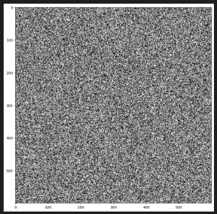

Max value of original image is 255. So need to convert white_noise to 255. Mixing noise image with original image.
```Python
img.max()

white_noise = white_noise * 255
display_img(white_noise)

noise_img = white_noise + img
display_img(noise_img)
```
Able to improve noise in the text compared to original image, still there are limited amount of noise present. Opening is useful for removing background noise. 

Subtract each pixel with -255, have only noise on the forground, or on the text area, not on the background. So we use closing to clean up the mess.
```Python
black_noise = np.random.randint(low = 0, high = 2, size = (600, 600))
black_noise = black_noise * -255

black_noise
black_noise_img = img + black_noise

closing = cv2.morphologyEx(black_noise_img, cv2.MORPH_CLOSE, kernel)
```
Morphological gradient takes difference between dilation and erosion. Erosion operation will remove extra portion from image, where as dilation adds extra portion on image and morphological gradient takes difference between the two.  
```Python
gradient = cv2.morphologyEx(img, cv2.MORPH_GRADIENT, kernel)
display_img(gradient)
```
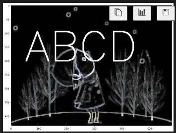

## Gradient 
Extension of Morphologocal transformation, helps in edge detection, object detection, object tracking and image classification.Applying x gradient we can see vertical lines and applying y gradient we can see horizontal lines.
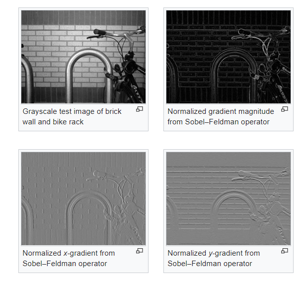 

The operators uses two 3 x 3 kernels convolved with original image A to compute approximations of deravities one for horizontal changes and one for vertial changes. 
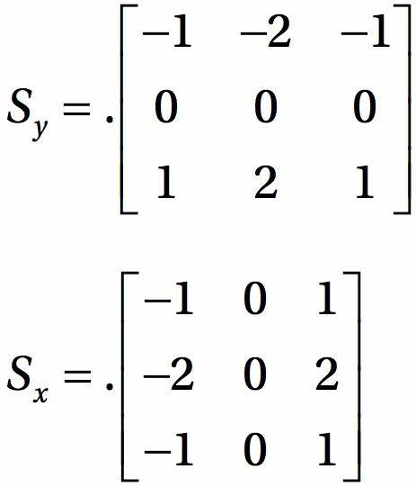

```Python 
import cv2
import numpy as np
import matplotlib.pyplot as plt

def display_img(img):
    fig = plt.figure(figsize=(12, 10))
    ax = fig.add_subplot(111)
    ax.imshow(img, cmap = 'gray')

img = cv2.imread('sudoko.jpg', 0)
display_img(img)
```
### Sobal X gradient
```Python
sobalx = cv2.Sobel(img, cv2.CV_64F, dx=1, dy =0, ksize=5)
display_img(sobalx)
```
Output
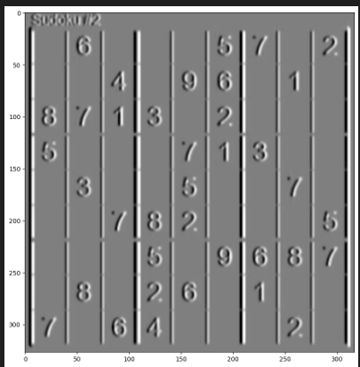

### Sobal Y gradient
```Python
sobaly = cv2.Sobel(img, cv2.CV_64F, dx=0, dy =1, ksize=5)
display_img(sobaly)
```
Output
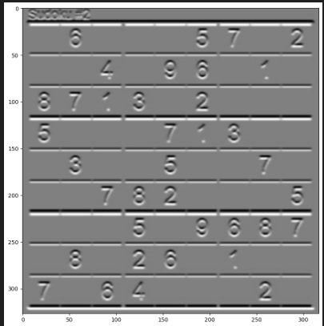

### Lapcian image edge detection
Can detect edge detection on both x and y direction simultaneously.
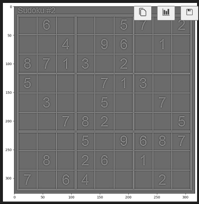

### Bledning both sobalx and sobaly 
```Python
blended = cv2.addWeighted(src1=sobalx, alpha=0.5, src2=sobaly, beta=0.5, gamma = 0)
display_img(blended)
```
Output
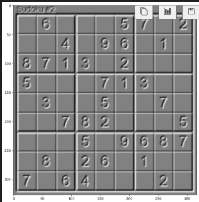

Applying thresholding method for edge detection
```Python
ret, th1 = cv2.threshold(img, 100, 255, cv2.THRESH_BINARY)
display_img(th1)
```
Output
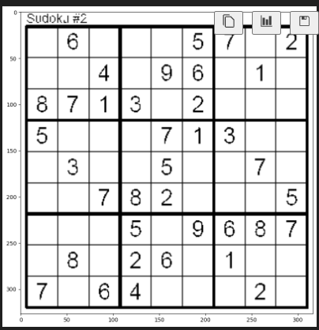

Implementing gradient morphology. We can use other methods to eliminate noise form the image and clear up the image. 
```Python
kernel = np.ones((4, 4), np.uint8)
gradient_1 =cv2.morphologyEx(blended, cv2.MORPH_GRADIENT, kernel)
display_img(gradient_1)
```
Output
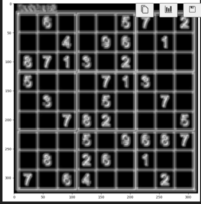

## Histogram
Display frequency of values of pixel color channel presenent in an image between 0 - 255, ploting RGB histogram
 ```Python
import cv2
import numpy as np
import matplotlib.pyplot as plt

dark_horse = cv2.imread('horse.jpg') #Original BGR opencv 
show_horse = cv2.cvtColor(dark_horse, cv2.COLOR_BGR2RGB) #Converted to RGB
plt.imshow(show_horse)

ranbow = cv2.imread('ranbow.jpg') #Original BGR opencv 
show_ranbow = cv2.cvtColor(ranbow, cv2.COLOR_BGR2RGB) #Converted to RGB
plt.imshow(show_ranbow)

blue_bricks = cv2.imread('brick.jpg') #Original BGR opencv 
show_bricks = cv2.cvtColor(blue_bricks, cv2.COLOR_BGR2RGB) #Converted to RGB
plt.imshow(show_bricks)
 ```
Ploting hist gram of blue channel i.e. at index 0
```Python
hist_val = cv2.calcHist([blue_bricks], channels = [0], mask = None, histSize = [256], ranges = [0, 256])
hist_val.shape

plt.plot(hist_val)
```
Output
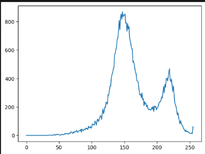
  ```Python
hist_val = cv2.calcHist([dark_horse], channels = [0], mask = None, histSize = [256], ranges = [0, 256])

plt.plot(hist_val)
  ```
  In this most of the blue color channeled value are closer to zero since most of the color is black. 
   Output
   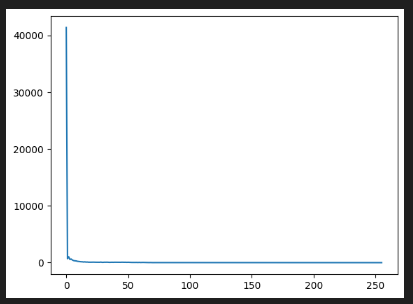

   ## 3 color histogram
```Python
img = blue_bricks

color = ('b', 'g', 'r')

for i, col in enumerate(color):
    hist_plot = cv2.calcHist([img], [i], None, [256], [0, 256])
    plt.plot(hist_plot, color = col)
    plt.xlim([0, 256])

plt.title('Histogram for Blue Bricks')
```
Output
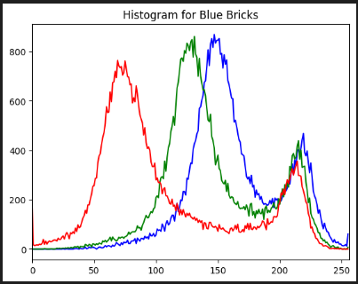

There are limited contribution from red color, more contributions are seen from blue and green color. 

Similarely for dark horse.
```Python
img = dark_horse

color = ('b', 'g', 'r')

for i, col in enumerate(color):
    hist_plot = cv2.calcHist([img], [i], None, [256], [0, 256])
    plt.plot(hist_plot, color = col)
    plt.xlim([0, 10])
    plt.ylim([0, 10000])

plt.title('Histogram for dark horse')
```
Output
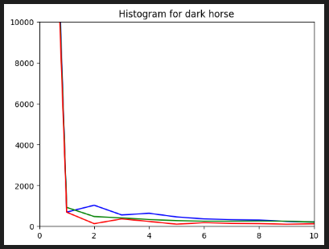

### Histogram mask and histogram equilizer
Can select particular region of interest and calculate color histogram of the masked section. Histogram Equalization is a method of contrast adjustment based on the image's histogram; increase or decrease contrast of image based on histogram. Making low contrast image with high contrast image, before it would be more irrigural but after applying histogram contrast we get the contrast more linear. 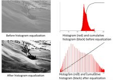

```Python
ranbow = cv2.imread('ranbow.jpg') #Original BGR opencv 
show_ranbow = cv2.cvtColor(ranbow, cv2.COLOR_BGR2RGB) #Converted to RGB
plt.imshow(show_ranbow)

ranbow.shape

creat_mask = np.zeros(show_ranbow.shape[0:2], np.uint8)
plt.imshow(creat_mask, cmap='gray')

creat_mask[100:150, 100:140] = 255

plt.imshow(creat_mask, cmap='gray')
```
Output
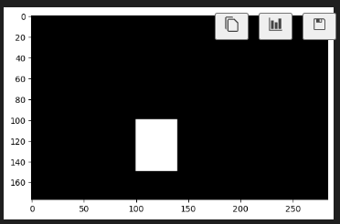

```Python

masked_img = cv2.bitwise_and(ranbow, ranbow, mask = creat_mask)
show_masked_img =cv2.bitwise_and(show_ranbow, show_ranbow, mask = creat_mask)

plt.imshow(show_masked_img)
```
Output
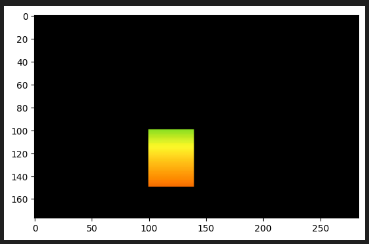

```Python
hist_mask_vals = cv2.calcHist([ranbow], channels=[2], mask=creat_mask, histSize=[256], ranges=[0, 256])
hist_vals = cv2.calcHist([ranbow], channels=[2], mask=None, histSize=[256], ranges=[0, 256])


plt.plot(hist_mask_vals)
plt.title('Red Histogram')

plt.plot(hist_vals)
plt.title('Red Histogram normal ranbow')
```

Output
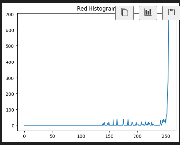

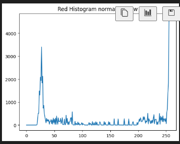

## Histogram Equilization
```Python
hist_values = cv2.calcHist([gorilla], channels=[0], mask=None, histSize=[256], ranges=[0, 256])
plt.plot(hist_values)
```
Output
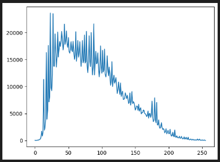

```Python
gorilla = cv2.imread('gorilla.jpg', 0)

def display_img(img, cmap =None):
    fig = plt.figure(figsize=(12, 10))
    ax = fig.add_subplot(111)
    ax.imshow(img, cmap = 'gray')

eq_gorilla = cv2.equalizeHist(gorilla)
display_img(eq_gorilla, cmap='gray')
```
Output
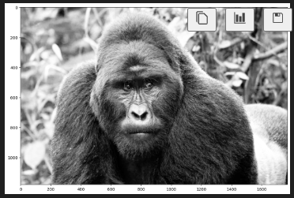

```Python
ist_value =cv2.calcHist([eq_gorilla], channels=[0], mask=None, histSize=[256], ranges=[0, 256])

hsv = cv2.cvtColor(gorilla, cv2.COLOR_BGR2HSV)

hsv[:,:, 2]

eq_col_gorl = cv2.cvtColor(hsv, cv2.COLOR_HSV2RGB)
display_img(eq_col_gorl)
```