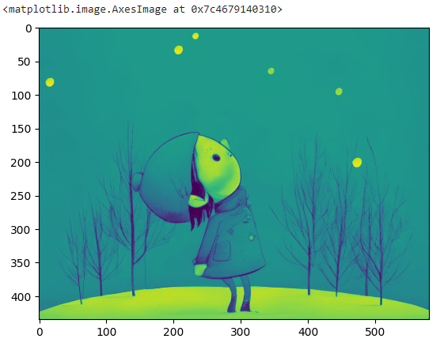
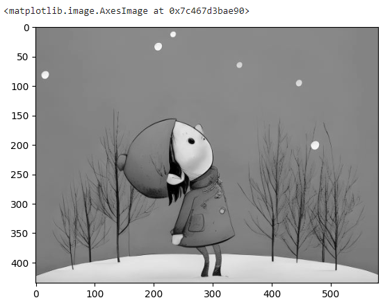
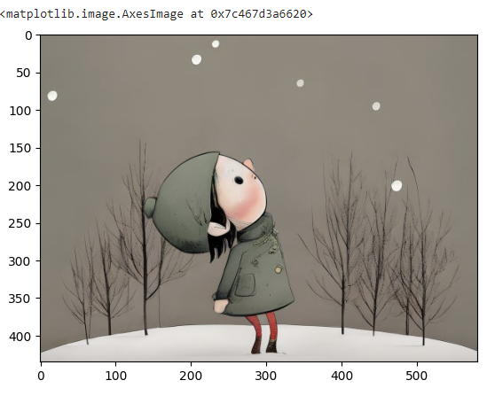
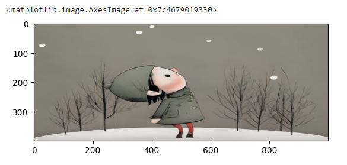
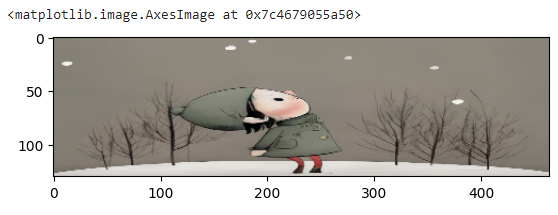
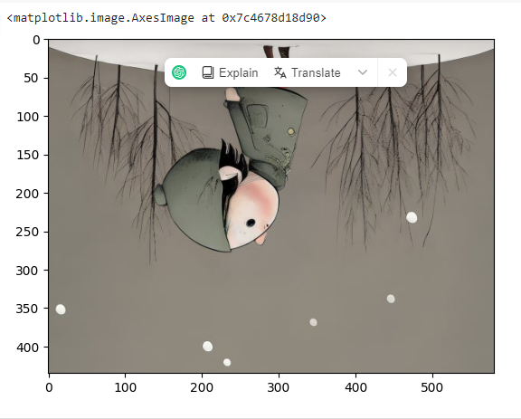
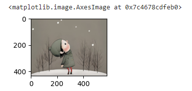

# NumPy
NumPy arrays are faster and more compact than python list, consuming less memory and stores homogemous data type unlike python list which stores heterogenous data type.            
An array is data structur.
Contains details on locating element and intepret the element.  

In open cv image is stored in the form of an array
```Python
import numpy as np

py_list = [95, 34, 65, 90, 30, 55]
print(py_list)
type(py_list)

# converting python list to numpy array
numpy_array = np.array(py_list)
numpy_array
type(numpy_array)
```
```Python
[95, 34, 65, 90, 30, 55]
list

array([95, 34, 65, 90, 30, 55])
numpy.ndarray
```
Gray scale image is stored in the form of 2D array whose pixel value ranges from 0 to 255. Has only one channel, typically 8-bit integer representing black 0 and 255 white since pixel is represent single pixel intensity value, either white or black.


```Python
numpy_2d_array = np.array([[1, 2, 3, 4], [5, 6, 7, 8], [9, 10, 11, 12]])
numpy_2d_array
```
```Python
array([[ 1,  2,  3,  4],
       [ 5,  6,  7,  8],
       [ 9, 10, 11, 12]])
```
2D array is nested python list
```Python
# Step 1: Start with an Empty List
nested_list = []

# Step 2: Add the First Inner List
nested_list.append([1, 2, 3])

# Step 3: Add the Second Inner List
nested_list.append([4, 5, 6])

# Step 4: Add the Third Inner List
nested_list.append([7, 8, 9])

# Display the Nested List
print("Nested List:")
for inner_list in nested_list:
    print(inner_list)

```
In NumPy occassionally reference are made on **ndarray** which is ***N-dimensional*** array. he NumPy ndarray class is used to represent both matrices and vectors. A vector is an array with a single dimension (there’s no difference between row and column vectors), while a matrix refers to an array with two dimensions.
```Python
# np.arange(starting, ending, interval)
np.arange(0, 10, 2)
```
Ouput                   
```Python
array([0, 2, 4, 6, 8])
```
```Python
np.zeros(shape = (4, 5))
```
Output:                         
```Python
array([[0., 0., 0., 0., 0.],
       [0., 0., 0., 0., 0.],
       [0., 0., 0., 0., 0.],
       [0., 0., 0., 0., 0.]])
```
```Python
np.ones(shape = (4, 5))
```
Output:                         
```Python
array([[1., 1., 1., 1., 1.],
       [1., 1., 1., 1., 1.],
       [1., 1., 1., 1., 1.],
       [1., 1., 1., 1., 1.]])
```

```Python
np_array = np.arange(0, 100).reshape(10, 10)
np_array
```
Output:                             
```Python
array([[ 0,  1,  2,  3,  4,  5,  6,  7,  8,  9],
       [10, 11, 12, 13, 14, 15, 16, 17, 18, 19],
       [20, 21, 22, 23, 24, 25, 26, 27, 28, 29],
       [30, 31, 32, 33, 34, 35, 36, 37, 38, 39],
       [40, 41, 42, 43, 44, 45, 46, 47, 48, 49],
       [50, 51, 52, 53, 54, 55, 56, 57, 58, 59],
       [60, 61, 62, 63, 64, 65, 66, 67, 68, 69],
       [70, 71, 72, 73, 74, 75, 76, 77, 78, 79],
       [80, 81, 82, 83, 84, 85, 86, 87, 88, 89],
       [90, 91, 92, 93, 94, 95, 96, 97, 98, 99]])
```
### Python Image Library
Supported file formats include PPM, PNG, JPEG, GIF, TIFF, and BMP. 

```Python
import numpy as np
import matplotlib.pyplot as plt
from PIL import Image

picture = Image.open('card-2.jpg')
picture

type(picture)
```
Output:                             

```Python
PIL.JpegImagePlugin.JpegImageFile
```
```Python
# converting image into numpy array
picture_array = np.asanyarray(picture)
picture_array
```
The purpose of converting an image (presumably stored in the variable picture) to a NumPy array could be to perform various operations on the image using NumPy's array manipulation capabilities. NumPy arrays are widely used in image processing because they provide efficient and convenient ways to perform mathematical operations on pixel values. For example, you might want to perform operations like cropping, resizing, filtering, or any other image manipulation using the tools provided by NumPy once the image is represented as an array.

```Python
 # read the image directly as numpy array; do not have to transform image to numpy array
 # if you provide wrong path it will not give error, check type and it will return None if file path is wrong
img = cv2.imread('card-2.jpg')
img

type(img)

img.shape
```
Output:
```Python
numpy.ndarray

(435, 580, 3)
```
```Python
# The Bluish color of the image is due to color sequence interpretation by matplot lib and open CV
# MATPLOTLIT -----> RGB or RED GREEN BLUE
# OPENCV ---------> BGR or BLUE GREEN RED
# RED and BLUE gets swapped.
plt.imshow(img)
```


```Python 
# to solve the issue above we use cvt
# take the original image and read as BLUE GREEN RED and convert it to RED GREEN BLUE
conv_image = cv2.cvtColor(img, cv2.COLOR_BGR2RGB)
conv_image

plt.imshow(conv_image)
```
Output:                 


```Python
img_gray = cv2.imread('card-2.jpg',cv2.IMREAD_GRAYSCALE)
img_gray

img_gray.max()

img_gray.min()

img_gray.shape

plt.imshow(img_gray)
```

Output:
```Python
array([[128, 129, 130, ..., 131, 131, 131],
       [128, 129, 130, ..., 131, 131, 131],
       [128, 129, 130, ..., 131, 131, 131],
       ...,
       [187, 207, 196, ..., 205, 200, 201],
       [104, 174, 200, ..., 207, 208, 205],
       [ 39, 140, 198, ..., 204, 184, 144]], dtype=uint8)


255 max

0 min

(435, 580) size of above array
```


```Python
plt.imshow(img_gray, cmap = 'gray')
```
Output              


Original image is as shown below
```Python
# Resizing images
plt.imshow(conv_image)

conv_image.shape

new_img = cv2.resize(conv_image, (1000, 400))

plt.imshow(new_img)
```
Output:             


```Python
(435, 580, 3)
```


# Can be resized by ration 
```Python
# rezise by ratio
w_ratio = 0.8
h_ratio =0.3

# gives numpy array
new_imgpro = cv2.resize(conv_image, (0, 0), conv_image, w_ratio, h_ratio)
new_imgpro

plt.imshow(new_imgpro) 
```
Output                      


We can flip image upside down aswell
```Python
new_imgpro.shape

new_img_flip = cv2.flip(conv_image, 0)
plt.imshow(new_img_flip)
```
Output:             
```Python
(130, 464, 3)
```


```Python
# saving image file, numpy arrayto save
cv2.imwrite('totally_new.jpg', new_img_flip )

# code to define the amout of canvas space I can use
fig =plt.figure(figsize = (2, 2))
ax = fig.add_subplot(111)
ax.imshow(conv_image)
```
Output:             
