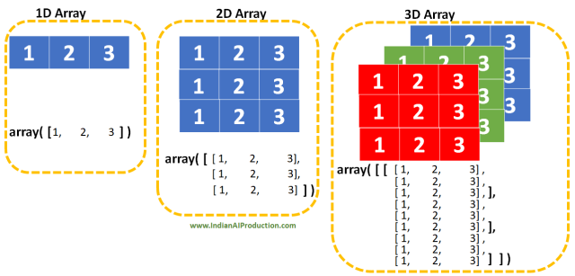

# NumPy
NumPy arrays are faster and more compact than python list, consuming less memory and stores homogemous data type unlike python list which stores heterogenous data type.            
An array is data structur.
Contains details on locating element and intepret the element.  

In open cv image is stored in the form of an array
```Python
import numpy as np

py_list = [95, 34, 65, 90, 30, 55]
print(py_list)
type(py_list)

# converting python list to numpy array
numpy_array = np.array(py_list)
numpy_array
type(numpy_array)
```
```Python
[95, 34, 65, 90, 30, 55]
list

array([95, 34, 65, 90, 30, 55])
numpy.ndarray
```
Gray scale image is stored in the form of 2D array whose pixel value ranges from 0 to 255. Has only one channel, typically 8-bit integer representing black 0 and 255 white since pixel is represent single pixel intensity value, either white or black.


A vector is an array with a single dimension (there’s no difference between row and column vectors), while a matrix refers to an array with two dimensions. For 3-D or higher dimensional arrays, the term tensor is also commonly used.
```Python
numpy_2d_array = np.array([[1, 2, 3, 4], [5, 6, 7, 8], [9, 10, 11, 12]])
numpy_2d_array
```
```Python
array([[ 1,  2,  3,  4],
       [ 5,  6,  7,  8],
       [ 9, 10, 11, 12]])
```
2D array is nested python list
```Python
# Step 1: Start with an Empty List
nested_list = []

# Step 2: Add the First Inner List
nested_list.append([1, 2, 3])

# Step 3: Add the Second Inner List
nested_list.append([4, 5, 6])

# Step 4: Add the Third Inner List
nested_list.append([7, 8, 9])

# Display the Nested List
print("Nested List:")
for inner_list in nested_list:
    print(inner_list)

```
