# Section 6 Object detection 
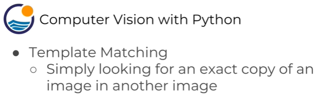
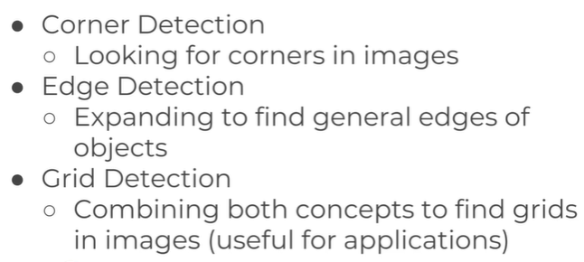
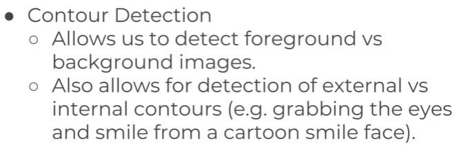
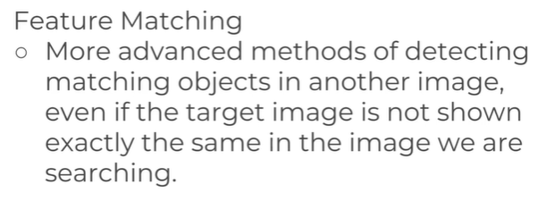
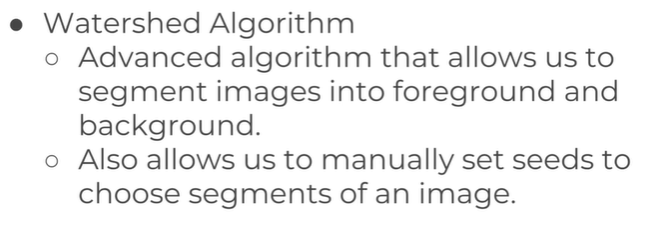
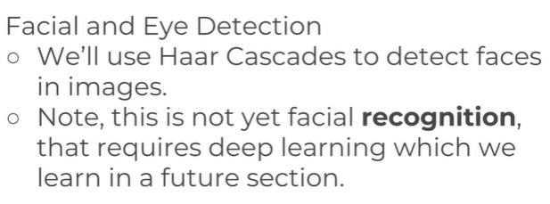

## Template Matching
Simplest form of Object Detection.
Template matching is image processing technique to match small image(template) which is part of large image with the large image.

This technique is widely used for object detection projects, like product quality, vehicle tracking, robotics etc

#### Analogy
Its like specific artical or image from a newspaper page, say finding suduko from larger news paper page which involve scanning through entire newspaper page and compare each section with smaller image or specific artical/template. The goal is to find regions where the contenet of the newpaper page closely matches the desired template. 
During template matching, a correlation map is created. It's like keeping track of how well the content of the newspaper page matches your template at different locations. High values in the correlation map indicate strong matches. Once the template matching process is complete, you can identify the location where the correlation is highest. This location corresponds to the position on the newspaper page where your template (specific article or image) is located.
```Python
import cv2
import numpy as np
import matplotlib.pyplot as plt


image = cv2.imread('card-2.jpg')

image = cv2.cvtColor(image, cv2.COLOR_BGR2RGB)

plt.imshow(image)
```

Output:                         
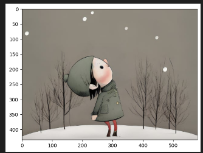

Its part of the larger image **card-2**. The lareger image size is more than image size of head image. It will scann through each pixel of the image and find the match. 
```Python
head = cv2.imread('card-3.png')

head = cv2.cvtColor(head, cv2.COLOR_BGR2RGB)
plt.imshow(head)
```
Output:                      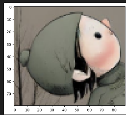

Size difference between image and shape image
```Pytho
image.shape

head.shape
```
Output:                 
```Python
(435, 580, 3)

(80, 89, 3)
```

With method considered, heatmap is generated based on higher degree of correlation we find after scanning between main image and template image or shows where maximum values are matched.                  
The **eval** takes string say "5+8" and convert it to python form of 5 + 8 to perform python task such as arithmatic operation etc.resulting 13 as output.
```Python
my_method = eval('cv2.TM_CCOEFF')
res = cv2.matchTemplate(image, head, my_method)

plt.imshow(res)
```
Output:                             
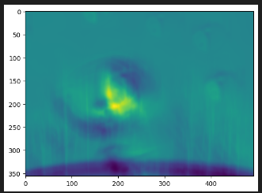

Example or explination
```Python
# Define a mathematical expression as a string
expression = "5 + 3"

# Use eval to evaluate the string as a Python expression
result = eval(expression)

# Print the result
print("The result of the expression", expression, "is:", result)
```
Output:                             
```Python
The result of the expression 5 + 3 is: 8
```
We will find max and min values of the heatmap, max and min value location and then use that to draw red rectangle around the match of the template.

```Python 
# 6 methods for comparison in a list
# line initializes a list called methods containing strings representing different template matching techniques in OpenCV, including correlation methods
methods =['cv2.TM_CCOEFF', 'cv2.TM_CCOEFF_NORMED', 'cv2.TM_CCORR', 'cv2.TM_CCORR-NORMED', 'cv2.TM_SQDIFF', 'cv2.TM_SQDIFF_NORMED']

for method in methods:
     # creating copy of original image
    image_copy = image.copy()
    
    technique = eval(method)

    #template matching
    # emplate matching is performed using the specified technique, comparing the input image (image) with the template image (head). The result is a correlation map stored in the variable result
    result = cv2.matchTemplate(image, head, technique)

    # Tuple unpacking
    min_val, max_val, min_loc, max_loc = cv2.minMaxLoc(result)

    if technique in [cv2.TM_SQDIFF, cv2.TM_SQDIFF_NORMED]:
        top_left = min_loc
    else:
        top_left = max_loc
     
    height, width, channels = head.shape
    
    bottom_right = (top_left[0] + width, top_left[1]+height)
    cv2.rectangle(image_copy, top_left, bottom_right, color=(255, 0, 0), thickness= 10 )

    plt.subplot(121)
    plt.imshow(result)

    plt.title('Template Matching')
    plt.subplot(122)
    plt.imshow(image_copy)
    plt.title('Detection of Template')
    plt.suptitle(method)

    plt.show()

    print('\n')
    print('\n')
```
Output:                             
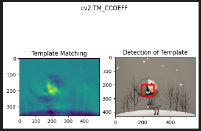
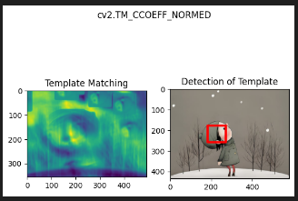

Did not find the correct match
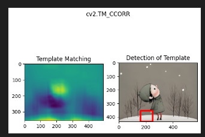

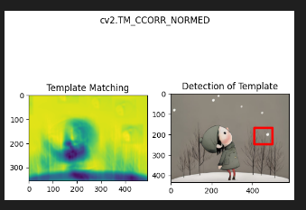
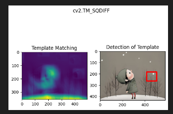
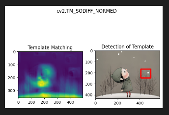

Method 2 without uning eval function
```Python
methods = [cv2.TM_CCOEFF, cv2.TM_CCOEFF_NORMED, cv2.TM_CCORR, cv2.TM_CCORR_NORMED, cv2.TM_SQDIFF, cv2.TM_SQDIFF_NORMED]

for method in methods:
    # creating a copy of the original image
    image_copy = image.copy()

    # template matching using the correct technique
    result = cv2.matchTemplate(image, head, method)

    # Tuple unpacking
    min_val, max_val, min_loc, max_loc = cv2.minMaxLoc(result)

    if method in [cv2.TM_SQDIFF, cv2.TM_SQDIFF_NORMED]:
        top_left = min_loc
    else:
        top_left = max_loc

    height, width, channels = head.shape

    bottom_right = (top_left[0] + width, top_left[1] + height)
    cv2.rectangle(image_copy, top_left, bottom_right, color=(255, 0, 0), thickness=10)

    plt.subplot(121)
    plt.imshow(result)

    plt.title('Template Matching')
    plt.subplot(122)
    plt.imshow(image_copy)
    plt.title('Detection of Template')
    plt.suptitle(method)

    plt.show()

    print('\n')
    print('\n')
```

For Methods like cv2.TM_SQDIFF and cv2.TM_SQDIFF_NORMED:

These methods focus on finding the smallest differences between the template and the image.
In this case, the smaller the value, the better the match. The minimum value in the correlation map indicates the location where the template is the most similar to the image.
Therefore, the top-left corner of the rectangle is set to the location of the minimum value in the correlation map.
For Other Methods like cv2.TM_CCOEFF, cv2.TM_CCOEFF_NORMED, cv2.TM_CCORR, cv2.TM_CCORR_NORMED:

These methods focus on finding the largest correlations between the template and the image.
In this case, the larger the value, the better the match. The maximum value in the correlation map indicates the location where the template is the most similar to the image.
Therefore, the top-left corner of the rectangle is set to the location of the maximum value in the correlation map.

## Corner Detection
Corners is junction of two edges.
Popular corner detection algorithms:
Harris Corner Detection
Shi-Tomasi Corner Detection
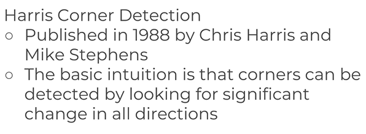
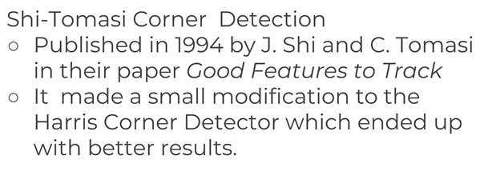
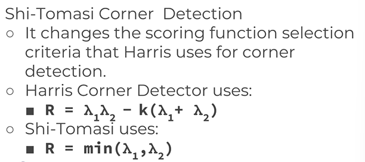

```Python
import cv2
import numpy as np
import matplotlib.pyplot as plt

flat_chess = cv2.imread('chess.jpg')
flat_chess = cv2.cvtColor(flat_chess, cv2.COLOR_BGR2RGB)
plt.imshow(flat_chess)
```
Output:             
![alt text]
(image-70.png)

```Python
gray_falt_chess = cv2.cvtColor(flat_chess, cv2.COLOR_BGR2GRAY)
plt.imshow(gray_falt_chess, cmap ='gray')
```
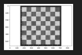

```Python
real_chess = cv2.imread('real_chess.jpg')
real_chess =cv2.cvtColor(real_chess, cv2.COLOR_RGB2BGR)
plt.imshow(real_chess)
```
Output:                         
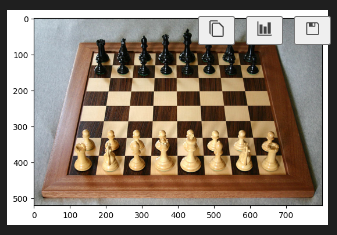

#### Gray scale form of the image
```Python
gray_real_chess = cv2.cvtColor(real_chess, cv2.COLOR_RGB2GRAY)
plt.imshow(gray_falt_chess, cmap = 'gray')
```
Output:                 
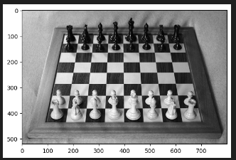

#### Applying Harris corner detection
For Harris corner detection the value should be in float, right now we have only integer value.
```Python
float_gray = np.float32(gray_falt_chess)
float_gray
```
Output:                 
```Python
array([[255., 255., 255., ..., 255., 255., 255.],
       [255., 255., 255., ..., 255., 255., 255.],
       [255., 255., 255., ..., 255., 255., 255.],
       ...,
       [255., 255., 255., ..., 255., 255., 255.],
       [255., 255., 255., ..., 255., 255., 255.],
       [255., 255., 255., ..., 255., 255., 255.]], dtype=float32)
```
```Python
dest_var_name = cv2.cornerHarris(src=float_gray, blockSize=2, ksize=3, k=0.04)
dest_var_name = cv2.dilate(dest_var_name, None)
flat_chess[dest_var_name>0.01*dest_var_name.max()] =[0, 0, 255]
plt.imshow(flat_chess)
```
Output:                         
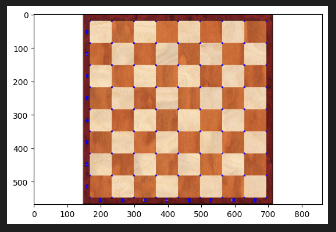

```Python
real_chessboard = np.float32(gray_real_chess)
dst = cv2.cornerHarris(src=real_chessboard, blockSize=2, ksize=3, k=0.04)

dst = cv2.dilate(dst, None)

real_chess[dst > 0.01 * dst.max()] = [255, 0, 0]
plt.imshow(real_chess)
```
Output:                                 
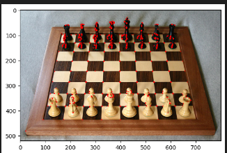

### Shi-Tomasi Corner Detection
Unlike Harris Corner Detection it will not detect all the corners but in this method we have to flatten the image to detect the corners.
```Python
flat_chess = cv2.imread('chess.jpg')
flat_chess = cv2.cvtColor(flat_chess, cv2.COLOR_BGR2RGB)

real_chess = cv2.imread('real_chess.jpg')
real_chess =cv2.cvtColor(real_chess, cv2.COLOR_RGB2BGR)

gray_falt_chess = cv2.cvtColor(flat_chess, cv2.COLOR_BGR2GRAY)
gray_real_chess = cv2.cvtColor(real_chess, cv2.COLOR_RGB2GRAY)

corners = cv2.goodFeaturesToTrack(gray_falt_chess, 64, 0.01, 10)

corners =np.int0(corners)

for i in corners:
    x, y = i.ravel()
    cv2.circle(flat_chess, (x,y), 3, (0, 255, 0), -1)

plt.imshow(flat_chess)
```
Output:                         
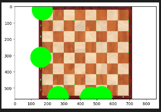

```Python
corners_1 = cv2.goodFeaturesToTrack(gray_real_chess, 80, 0.01, 10)

corners_1 = np.int0(corners_1)

for i in corners_1:
    x, y = i.ravel()
    cv2.circle(real_chess, (x,y), 3, (255, 0, 255), -1)
plt.imshow(real_chess)
```
Output:                             
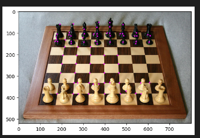

## Edge Detection
Canny Edge detector, multi-stage algorithm
First step is to Apply Gaussian Filter to smooth the image and remove noise.            
Find the intensity gradients of the image.
Apply non-maximum supression to get rid of spurious response to edge detection
Apply double threshold to determine potential edges
Track edges by hysteresis, detection of edges by supressiong all the other edges that are weak and not connected to strong edges or process of filtering the weaker edges and only keeping the strong edges. 

```Python
# reading an image 
img = cv2.imread('card-2.jpg')
plt.imshow(img)
```
Output:                                 

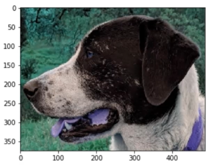
```Python

# set the threshold value initially at 127
edges = cv2.Canny(image=img, threshold1=127, threshold2=127)
plt.imshow(edges)
```
From the given image we can find some edges but also has capture some of the external edges which is probably noise.
Output:                         
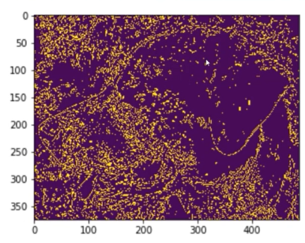

To solve the issue we can take two approaches where one is to blurring the image to eliminate certain details and other is to play with thresholds

```Python
# set the threshold value initially at 127
edges = cv2.Canny(image=img, threshold1=0, threshold2=255)
plt.imshow(edges)
```
With this setting we have picked up more details of the image.
Output:                             
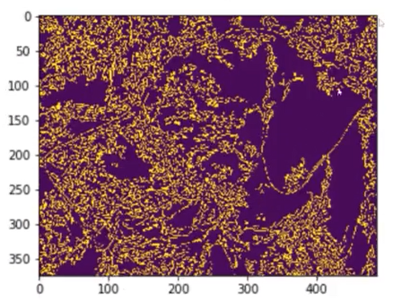

We have formula to to find the required value of the pixel
```Python
# setting up lower and upper bound threshold
# Lower threshold to either 0 or 70% of the median value which ever is greater
lower = int(max(0, 0.7 * med_val))
# upper threshold to either 130% of the median or the max 255, which ever is smaller
upper =  int(min(255, 1.3 * med_val))

edges = cv2.Canny(image=img, threshold1=lower, threshold2 = upper)
plt.imshow(edges)
```
capturing more details of the edges.
Output:                             
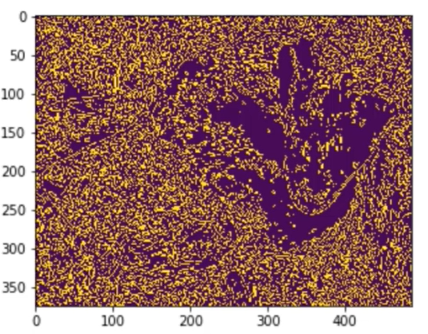

So trying to adjust the value of the upper bound will somewhat improve edge detection but it will not resolve the issue so better to opt for bluring the image option
```Python
edges = cv2.Canny(image=img, threshold1=lower, threshold2 = upper + 100)
plt.imshow(edges)
```                  
Output:                                 
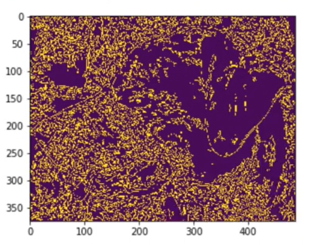

```Python
blur_img = cv2.blur(img, ksize = (5, 5))

edges = cv2.Canny(image=blur_img, threshold1=lower, threshold2 = upper)
plt.imshow(edges)
```
Now we can see stronger edges of the dog face
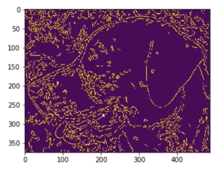

### Grid Detection
Often camerascreates distortion in image such as radial distortion  andtangential distortion

```Python
chess = cv2.imread('chess1.jpg')
plt.imshow(chess)

found, corners = cv2.findChessboardCorners(chess, (7, 7))

found
```
Output:   
found if its true corner is detected.
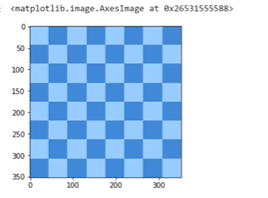

courners            
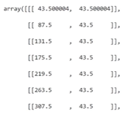

```Python
cv2.drawChessboardCorners(chess, (7,7), corners, found)

plt.imshow(chess)
```

Output:                 
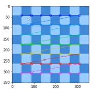

```Python
dotgrid = cv2.imread('squaredotgrid.jpg')
plt.imshow(dotgrid)

found, corner = cv2.findCirclesGrid(dotgrid, (10, 10), cv2.CALIB_CB_SYMMETRIC_GRID)
found

corner
```
Output:                         
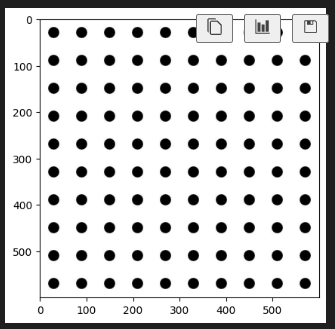

```Python
cv2.drawChessboardCorners(dotgrid, (10,10), corner, found)
plt.imshow(dotgrid)
```
this method is used for camera caliberation (grid detection method)
Ouput:                                  
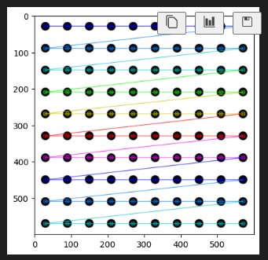
