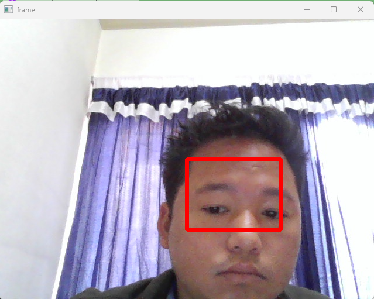
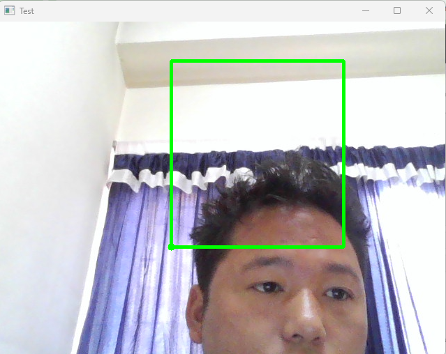

# Section 5 Videos Basics
## Connecting to Camera
cv2 is library which incorporates wide range of functionalities including image and vide processing like changing colored image grayscale, blur image, brighten dull image, past one image on to another etc. VideoCaputre is class or blue print that is specifically designed for video capture operations, allowing to access video streams from numerous sources, such as webcamp or vide files. 
```Python
import cv2
# cap is object representing video capture device like webcamp
# that was created earlier.
cap = cv2.VideoCapture(0) # default webcamp of laptop

# usually returns floating point but converting to int
# retrive height and width of video frames using get method
width = int(cap.get(cv2.CAP_PROP_FRAME_WIDTH))
height = int(cap.get(cv2.CAP_PROP_FRAME_HEIGHT))


while True:
    #tuple unpacking
    """The read() method returns two values as a 
    pair (a tuple). The first value, traditionally 
    named ret, is a boolean that indicates whether 
    the frame was successfully read. The second value, 
    traditionally named frame, is the actual image data 
    of the frame."""
    ret, frame = cap.read()

    gray = cv2.cvtColor(frame, cv2.COLOR_BGR2GRAY)

    cv2.imshow('frame', gray)

    if cv2.waitKey(1) & 0xFF == ord('q'):
        break
cap.release()
cv2.destroyAllWindows()
```
In order to see raw image that is color image we can comment out gray and pass frame in imshow instead of gray

Saving video file in specific location. To find the location of the filer you are in just type pwd to find file path. In the writer 20 means frame per second.

```Python
import cv2
# cap is object representing video capture device like webcamp
# that was created earlier.
cap = cv2.VideoCapture(0) # default webcamp of laptop

# usually returns floating point but converting to int
# retrive height and width of video frames using get method
width = int(cap.get(cv2.CAP_PROP_FRAME_WIDTH))
height = int(cap.get(cv2.CAP_PROP_FRAME_HEIGHT))

writer = cv2.VideoWriter('p:\\Pi OpenCV  programming\\frame.mp4', cv2.VideoWriter_fourcc(*'DIVX'),20, (width, height))

while True:
    #tuple unpacking
    """The read() method returns two values as a 
    pair (a tuple). The first value, traditionally 
    named ret, is a boolean that indicates whether 
    the frame was successfully read. The second value, 
    traditionally named frame, is the actual image data 
    of the frame."""
    ret, frame = cap.read()

    writer.write(frame)

    # gray = cv2.cvtColor(frame, cv2.COLOR_BGR2GRAY)

    cv2.imshow('frame', frame)

    if cv2.waitKey(1) & 0xFF == ord('q'):
        break
cap.release()
writer.release()
cv2.destroyAllWindows()
```

The code reads already existed video file, isOpened function gives error if file path mismatch otherwise OpenCV will just dont show any thing. Without time function only computer will be able to read the file, with time function human can see the image.
```Python
# reading already existed/downloaded video file 
import cv2
import time

cap = cv2.VideoCapture('frame.mp4')

if cap.isOpened() == False:
    print('File does not exist or wrong codec used')

while cap.isOpened():
    ret, frame = cap.read()
    if ret == True:
        time.sleep(1/20)
        cv2.imshow('frame', frame)

        if cv2.waitKey(1) & 0xFF == ord('q'):
            break
    else:
        break

cap.release()
cv2.destroyAllWindows()
```
### Drawing on Live Camera
```Python
import cv2

cap = cv2.VideoCapture(0)

width = int(cap.get(cv2.CAP_PROP_FRAME_WIDTH))
height = int(cap.get(cv2.CAP_PROP_FRAME_HEIGHT))


# TOP LEFT CORNER
x = width // 2
y = height // 2

# width and height of the rectangle
w = width // 4
h = height // 4 

# Bottom RIGHT CORNER x+w, y+h

while True:

    ret, frame = cap.read()

    cv2.rectangle(frame, (x, y), (x+w, y+h), color=(0, 0, 255), thickness=5)

    cv2.imshow('frame', frame)

    if cv2.waitKey(1) & 0xFF == ord('q'):
        break

cap.release()
cv2.destroyAllWindows()
```
Output image:



### Interactively draw 
```Python
import cv2


## call back function rectanlge
## defining some global variable
## connect to callback function

def draw_rectangle(event, x, y, flags, param):
    global pt1, pt2,topleft_clicked, bottomRight_clicked

    if event == cv2.EVENT_LBUTTONDOWN:
        # reset the rectanlge, it checks if the rectangle is there
        if topleft_clicked == True and bottomRight_clicked == True:
            pt1 = (0, 0) # top left
            pt2 = (0, 0)
            topleft_clicked = False
            bottomRight_clicked = False

        if topleft_clicked == False:
            pt1 = (x, y)
            topleft_clicked = True

        elif bottomRight_clicked == False:
            pt2 = (x, y)
            bottomRight_clicked = True


# defining coordinate/ global variable  
pt1 = (0, 0) # top left
pt2 = (0, 0) # bottom right

# if mouse is not clicked from top left corner or bottom 
# if clicked it will get update
topleft_clicked = False
bottomRight_clicked = False

# connect to call back
cap = cv2.VideoCapture(0)

cv2.namedWindow('Test')
cv2.setMouseCallback('Test', draw_rectangle)
while True:

    ret, frame = cap.read()

    # drawing on the frame based off the gloable varaible
    if topleft_clicked:
        cv2.circle(frame, center = pt1, radius=5, color=(0,255,0), thickness=-1)
    
    if topleft_clicked and bottomRight_clicked:
        cv2.rectangle(frame, pt1, pt2, (0, 255, 0), 3)


    cv2.imshow('Test', frame)

    if cv2.waitKey(1) & 0xFF == ord('q'):
        break

cap.release()
cv2.destroyAllWindows()

```
Output image:
